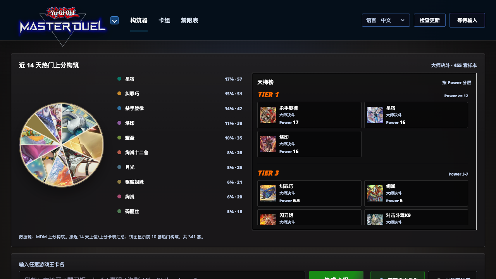
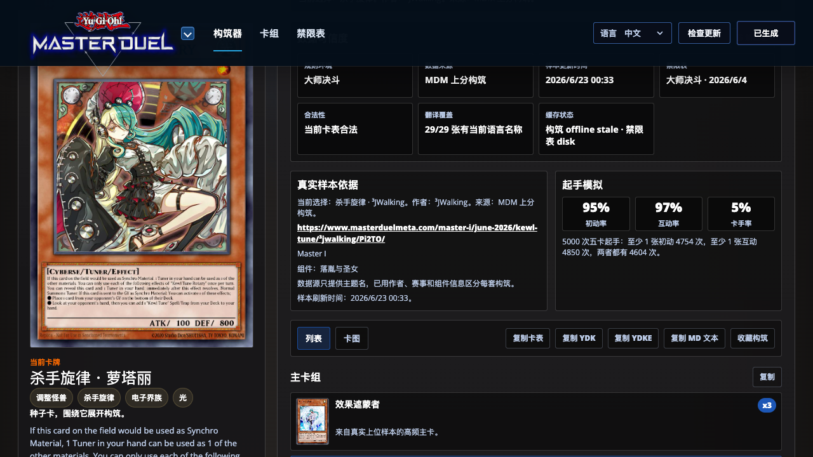
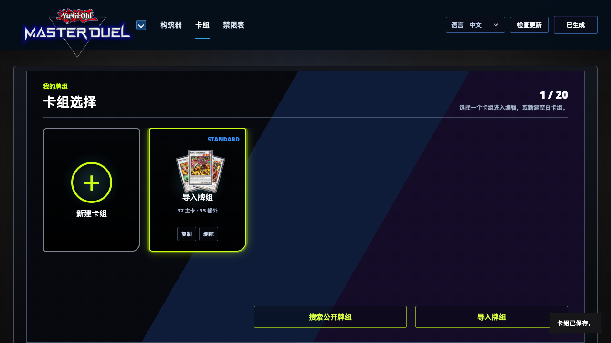
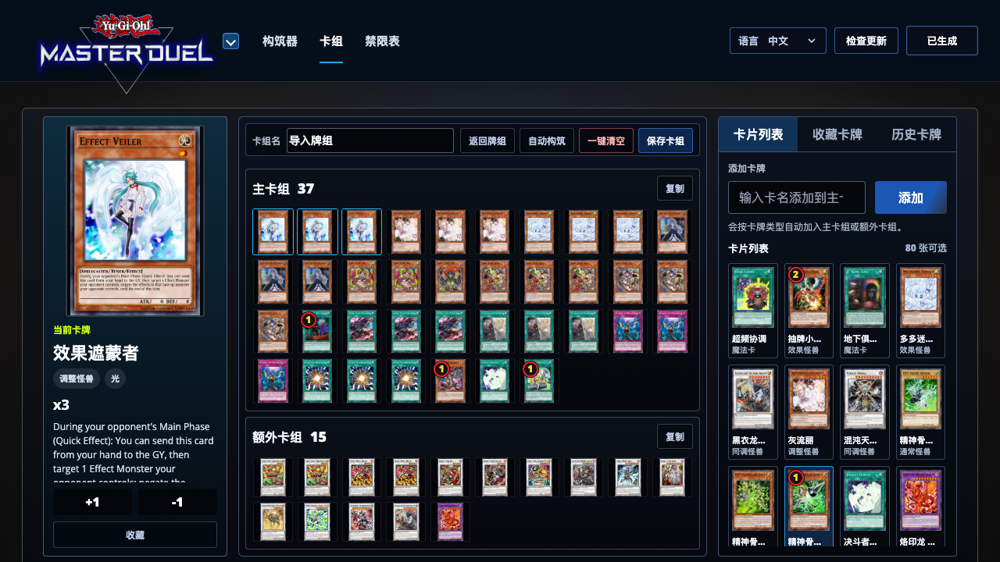

# Yu-Gi-Oh! Seed Deck Builder

一个本地运行的游戏王卡组构筑工具，面向大师决斗、OCG 和 TCG 环境。它可以从一张种子卡或一个系列名开始，结合近期真实样本、禁限表、官方卡名/效果文本和启发式评分，生成可继续编辑、收藏和导出的卡组。

## 功能概览

- 多环境切换：支持大师决斗、OCG、TCG，并按当前环境加载对应禁限表和样本数据。
- 热门构筑趋势：展示近期热门上分/上位构筑、样本占比和 Power 分层。
- 种子卡构筑：输入卡名或系列名，查看真实样本构筑列表，也可以生成 AI 推荐构筑。
- 真实样本优先：优先参考近 7 天真实样本，缺少近期样本时再回退到历史公开构筑。
- AI 推荐构筑：按主题浓度、后攻突破、控制干扰等策略生成 40-60 主卡 + 15 额外卡组。
- 卡牌本地化：卡名、字段、效果文会按所选语言显示，灵摆卡会拆分展示灵摆效果和怪兽效果。
- 本地卡组：可以新建、保存、复制、删除和导入卡组，记录收藏卡牌和历史卡牌。
- 导入/导出：支持 YDK 导入，以及 YDK、YDKE、Master Duel 文本等导出格式。
- 桌面客户端：Electron 打包，支持离线缓存模式、实时刷新模式和更新检查。

## 界面预览

### 热门趋势与天梯榜



### 构筑结果与样本依据



### 我的牌组



### 卡组编辑器



## 下载桌面版

最新版本可以在 GitHub Releases 下载：

[下载最新版本](https://github.com/chisan043/ygo-seed-deck-builder/releases/latest)

- macOS Apple Silicon：下载 `arm64.dmg`，或下载 `arm64-mac.zip`。
- Windows x64：下载 `win-x64-unpacked.zip`，解压后运行 `Yu-Gi-Oh! Seed Deck Builder.exe`。
- `SHA256SUMS` 文件可用于校验下载文件。

## 启动方式

### macOS

双击 `start-local-server.command` 使用本地缓存数据，启动快、离线也能用。

双击 `start-live-server.command` 使用实时刷新服务，页面会以 `?api=1` 打开，并通过本地 API 刷新趋势、天梯、构筑搜索和禁限表数据。

### Windows

双击 `start-local-server.bat` 使用本地缓存数据，需要已安装 Python 3。

双击 `start-live-server.bat` 使用实时刷新服务，需要已安装 Node.js。

## 桌面程序打包

安装依赖：

```bash
npm install
```

开发运行：

```bash
npm start
```

默认优先打开实时刷新模式；如果检查到网络不可用或本地刷新服务启动失败，会自动切到离线缓存模式。

桌面客户端会通过本地刷新服务缓存卡牌资源：首次启动实时模式会先显示资源下载进度，优先下载热门构筑相关小卡图，这一层准备完成后才进入应用；剩余小图和详情大图会继续在后台下载。后续启动会直接读取本地资源，避免重复下载。

需要强制离线缓存模式：

```bash
npm run start:offline
```

打包：

```bash
npm run build:win
npm run build:mac
```

`npm run build:win` 会生成 Windows x64 免安装目录。需要 Windows 安装包时，在 Windows 机器上运行：

```bash
npm run build:win:installer
```

构建产物会输出到 `release/`。桌面版菜单里可以在“自动选择模式”“离线缓存模式”和“实时刷新模式”之间切换。

## 测试

基础语法检查：

```bash
node --check app.js
node --check tools/check-local-deck-scope.mjs
node tools/check-local-deck-scope.mjs
```

发布前建议再跑一次浏览器烟测，覆盖搜索构筑、保存牌组、YDK 导入、卡组编辑器和历史卡牌记录。

## 版本规则

修复 bug、样式微调和小范围优化时提升 patch 版本，例如 `0.6.12` 到 `0.6.13`。

添加新功能时提升 minor 版本，例如 `0.6.12` 到 `0.7.0`。

## 主要文件

- `index.html`：页面结构
- `styles.css`：界面样式
- `app.js`：前端逻辑
- `data/`：本地缓存数据
- `electron/`：桌面程序入口
- `tools/`：数据同步、实时刷新服务和检查脚本
