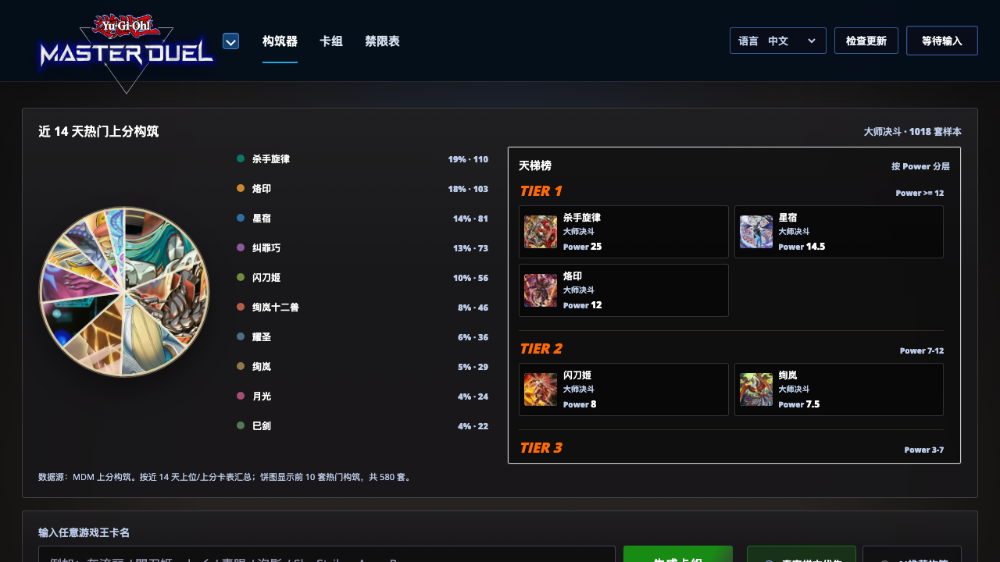
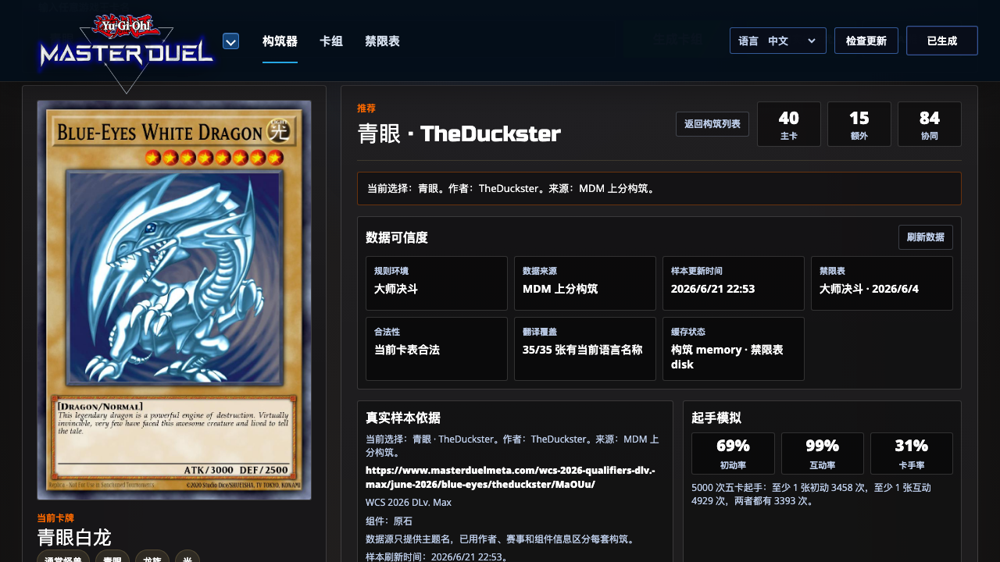
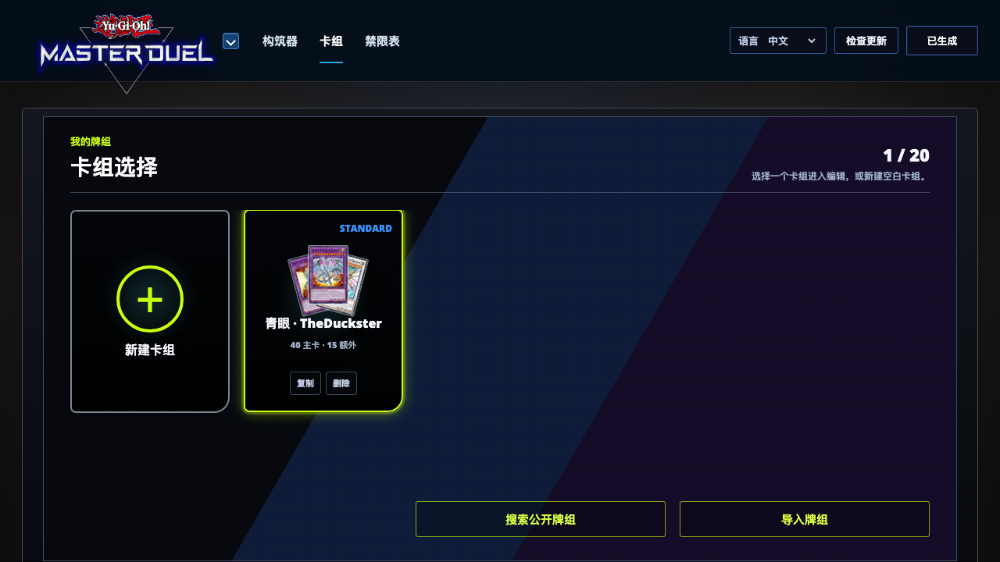
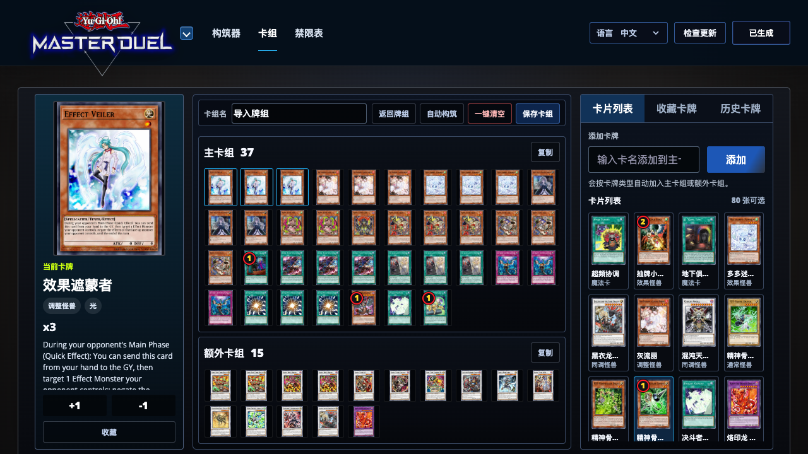

# Yu-Gi-Oh! Seed Deck Builder

一个本地运行的游戏王卡组构筑工具，面向大师决斗、OCG 和 TCG 环境。它可以从一张种子卡或一个系列名开始，结合近期真实样本、禁限表、官方卡名/效果文本和启发式评分，生成可继续编辑、收藏和导出的卡组。

## 功能概览

- 多环境切换：支持大师决斗、OCG、TCG，并按当前环境加载对应禁限表和样本数据。
- 热门构筑趋势：展示近期热门上分/上位构筑、样本占比和 Power 分层。
- 种子卡构筑：输入卡名或系列名，查看真实样本构筑列表，也可以生成 AI 推荐构筑。
- 真实样本优先：优先参考近 7 天真实样本，缺少近期样本时再回退到历史公开构筑。
- AI 推荐构筑：按主题浓度、后攻突破、控制干扰等策略生成 40-60 主卡 + 15 额外卡组。
- 卡牌本地化：卡名、字段、效果文会按所选语言显示，灵摆卡会拆分展示灵摆效果和怪兽效果。
- 本地卡组：可以新建、保存、复制、删除和导入卡组，记录收藏卡牌和历史卡牌。
- 导入/导出：支持 YDK 文件、YDKE 链接与卡名清单，预览后导入；可下载 YDK、复制 YDKE 或卡名清单。
- 大师决斗配方传输：通过浏览器扩展送至官方「我的卡组」，再在游戏内复制。
- 桌面客户端：Electron 打包，支持离线缓存模式、实时刷新模式和更新检查。

## 将配方导入大师决斗

1. 在常用的外部浏览器中安装 [Deck transfer 扩展](https://github.com/DawnbrandBots/deck-transfer-for-master-duel#readme)，登录官方「我的卡组」。游戏、官方数据库需关联同一 KONAMI ID，并关联 CARD GAME ID；你可按 [KONAMI 官方说明](https://us-support.konami.com/hc/en-us/articles/4813772381975-Is-it-possible-to-import-Deck-Lists-from-Official-Yu-Gi-Oh-TCG-Card-Database-to-Yu-Gi-Oh-MASTER-DUEL) 完成关联。
2. 在构筑结果或本地卡组编辑器点击「导入大师决斗」。工具检查主卡组 40–60 张、额外卡组最多 15 张、卡片所属分区、MD 可用性及合计张数限制，并显示禁限表日期。
3. 点击「打开官方编辑页并填入配方」。扩展需要英文版官方数据库；本工具仍使用你选择的语言。在官方编辑页核对卡片、填写卡组名并点击 **Save**。
4. 在游戏「卡组」页面打开官方数据库图标，选择该配方，再点击「复制卡组」。未持有的卡片仍需获取。

桌面客户端会打开默认外部浏览器。网页预览可能在内置浏览器打开链接，此时请复制传输链接到装有扩展的浏览器。若未自动填入，确认已登录且扩展启用，或复制 YDKE，在英文官方编辑页点击 **Import YDKE from clipboard**；也可下载 YDK 并使用扩展的文件导入。工具无法检测外部浏览器扩展、账号登录或游戏复制是否完成，不会仅因打开页面就报告传输成功。

反向导入：先在游戏中将配方导出至官方数据库，在配方页面用扩展 **Export YDK** 或 **Export YDKE to clipboard**，再在本工具「卡组」→「导入牌组」选择文件或粘贴代码，预览后保存。未知卡片会阻止导入；原始张数保留供编辑。当前编辑器只保存主卡组和额外卡组，遇到副卡组会在确认前提示。

YDKE 使用标准 Base64 编码和 32 位小端卡片密码，兼容社区工具；导入也接受本工具早期的 URL-safe 编码。传输协议来自扩展的 [公开测试说明](https://github.com/DawnbrandBots/deck-transfer-for-master-duel/blob/master/docs/TESTS.md)。本地验证覆盖编码、预览、下载与 MD 检查；官方账号保存和游戏内复制需要用户在实际账号上验证。

## 界面预览

### 热门趋势与天梯榜



### 构筑结果与样本依据



### 我的牌组



### 卡组编辑器



## 下载桌面版

最新版本可以在 GitHub Releases 下载：

[下载最新版本](https://github.com/chisan043/ygo-seed-deck-builder/releases/latest)

- macOS Apple Silicon：下载 `arm64.dmg`，或下载 `arm64-mac.zip`。
- Windows x64：推荐下载 `x64-setup.exe` 安装版，以支持重启自动安装更新。也可下载 `x64-unpacked.zip` 解压运行，或使用便携版。
- `SHA256SUMS` 文件可用于校验下载文件。

## 启动方式

### macOS

双击 `start-local-server.command` 默认优先使用实时刷新服务，趋势、天梯、构筑搜索和禁限表会抓最新数据；没有 Node.js 时会回退到本地缓存。需要强制离线缓存时运行 `YGO_OFFLINE=1 ./start-local-server.command`。

双击 `start-live-server.command` 使用实时刷新服务，页面会以 `?api=1` 打开，并通过本地 API 刷新趋势、天梯、构筑搜索和禁限表数据。

### Windows

双击 `start-local-server.bat` 默认优先使用实时刷新服务，需要已安装 Node.js；没有 Node.js 时会回退到本地缓存，需要已安装 Python 3。需要强制离线缓存时先设置 `YGO_OFFLINE=1`。

双击 `start-live-server.bat` 使用实时刷新服务，需要已安装 Node.js。

## 桌面程序打包

安装依赖：

```bash
npm install
```

开发运行：

```bash
npm start
```

默认优先打开实时刷新模式；如果检查到网络不可用或本地刷新服务启动失败，会自动切到离线缓存模式。

桌面客户端会通过本地刷新服务缓存卡牌资源：首次启动实时模式会先显示资源下载进度，优先下载热门构筑相关小卡图，这一层准备完成后才进入应用；剩余小图和详情大图会继续在后台下载。后续启动会直接读取本地资源，避免重复下载。

完整卡面随界面语言切换：中文、日文优先使用[百鸽公开卡图 CDN](https://ygocdb.com/api) 的高清社区卡图，英文沿用 YGOPRODeck。中日样图为 680×986、无 SAMPLE 水印；社区中文卡面可能使用社区译名。缩略图与详情大图按语言分别缓存在用户资源目录，按需下载，最多同时下载两张中日卡图。每天核对一次源站图片目录，图片有变化时自动替换，损坏下载或源站故障时保留已验证缓存；缺少对应语言图片时回退英文。榜单饼图使用不含文字的裁切插画，继续读取随包提供的离线图片。

桌面版三种语言的卡图下载统一通过 Electron 的 Chromium 网络栈，沿用系统代理、PAC 和系统证书设置，避免 Windows 浏览器能显示卡图、后台 Node 下载却失败的问题。英文下载会合并重复请求、校验 JPEG 文件头并原子写入缓存；已有错误页面缓存会在再次打开卡片时修复。首次预下载全部失败时显示下载错误，不会写入“准备完成”记录。发布构建在 Windows 和 macOS 上使用空资源目录验证三种语言首次下载与缓存复用。

需要强制离线缓存模式：

```bash
npm run start:offline
```

打包：

```bash
npm run build:win
npm run build:mac
```

`npm run build:win` 会生成 Windows x64 免安装目录。需要 Windows 安装包时，在 Windows 机器上运行：

```bash
npm run build:win:installer
```

构建产物会输出到 `release/`。桌面版菜单里可以在“自动选择模式”“离线缓存模式”和“实时刷新模式”之间切换。

## 程序自动更新

从 0.7.1 起，桌面版启动后和每 6 小时检查 GitHub 的稳定版 Release，并自动下载新程序。页面的“检查更新”可立即检查或重试。更新会验证安装包校验和，失败时继续使用当前程序；卡组和数据缓存保存在用户目录，升级时保留。

- Windows 安装版：下载完成后提示“重启并安装”，点击后安装并重新启动。普通退出不会擅自安装；请先保存正在编辑的卡组。
- Mac：当前未配置 Apple Developer ID 签名，自动下载并校验 DMG 后提示“打开安装包”，仍需完成系统安装步骤。不会绕过系统安全检查。
- Windows 便携版或解压版：自动下载并校验安装版 EXE，点击后打开安装器；安装一次后即可使用安装版自动升级。
- 浏览器、源码开发模式：保留 GitHub 下载页入口，不修改本地程序。

0.7.0 及更早的程序没有这一更新机制，需要先下载安装一次 0.7.1。程序更新以完整发布的 GitHub Release 为准，推送代码或数据缓存不会触发客户端安装。

发布流程在 macOS 和 Windows 上分别构建安装包，上传 `latest-mac.yml`、`latest.yml`、安装器及校验文件，全部上传后才发布 Release。手动运行默认只构建并校验，选中 `publish_release` 或推送匹配的版本标签才发布。已发布版本不可覆盖，请增加版本号并创建匹配的 `v版本号` 标签。

## 自动维护数据

从 0.7.0 起，实时服务启动后自动检查数据，并每 6 小时重试需要更新的来源。卡库与 MD 语言数据每天更新，禁限表和真实样本每 6 小时检查，卡包索引每周更新；构筑趋势和天梯榜也会同步到离线缓存。OCG、TCG 自动发现官方当前表，MD 使用当前数据源，未来生效的表不会提前应用。

桌面版把可变数据保存到用户数据目录，安装目录无需写权限；切换到离线模式会使用最近成功更新的缓存。正在打开的页面会检测后台更新并刷新卡库、趋势和禁限表，不会重载页面或丢弃正在编辑的牌组。

更新会校验卡牌数量、卡名映射、牌组完整性和 JSON/JS 一致性，临时卡号会归一到正式卡号，样本新鲜度始终根据日期重新计算。网络失败、来源为空或解析不完整时保留上次可用数据，并在页面显示缓存/重试状态。卡包下载提供 GitHub Blob API 备用路径，并用当前 TCG 卡包数据补充历史索引。

GitHub 的 `Refresh game data` 工作流每天北京时间 06:17 运行，也支持手动触发。它只提交通过校验的数据；部分来源失败时保存其他有效更新、保留旧缓存，并将本次工作流标为失败，附带 `data-health` 报告。GitHub 调度可能有延迟；完全离线时无法获得新的数据。

构筑名称与代表卡图由同一份 `trend-catalog` 管理，页面首次显示就可使用，不依赖用户先搜索卡片。更新程序统一处理名称大小写、标点、单复数、组合构筑和来源的不同语言别名，优先保留现有译名，从多张卡的中文、日文名称提取新系列名；语言缓存尚未收录的新系列会补查 KONAMI 对应语言的官方卡库。日语解析保留平假名、片假名和长音符，支持“道化の一座”前缀及“リゾネーター”后缀。代表图下载到 `data/trend-images/`，随离线包分发并复制到桌面版用户数据目录。榜单每次更新都会重新生成目录，同时校验当前 MD、OCG、TCG 的中文与日文名称、图片文件及校验和；任一语言缺失或混入未翻译英文时阻止发布。

若上游尚无可确认的对应语言译名或图片下载失败，保留上次有效目录并记录更新失败，下次自动重试；临时的新名称显示“译名待收录”或“名称の翻訳準備中”，原名保留在提示中。图片损坏会显示卡背，避免空白扇区。无需按月补写系列名；上游译文缺失时无法凭空保证准确翻译。单独重建名称和图片缓存可运行 `npm run sync:trend-catalog`，再运行 `npm run check:offline`。

手动运行统一更新：

```bash
npm run sync:data
# 忽略更新周期，重新核对全部来源
npm run sync:data -- --force
npm run check:data
```

诊断记录保存在 `data/data-health.json`；桌面版保存在用户数据目录下的 `data-cache/data-health.json`。实时服务的 `/api/data-health` 会返回各来源最近成功时间、错误与过期状态。外部网站大幅改版仍可能需要适配，但普通新增卡牌、禁限表换月和短暂断网不再需要逐月手动修复。

## 测试

基础语法检查：

```bash
node --check app.js
node --check tools/check-local-deck-scope.mjs
node tools/check-local-deck-scope.mjs
npm run check:offline
npm run check:data
```

如果手动更新了 `data/cardinfo-cache.json` 或 `data/limit-regulations/*.json`，先运行 `npm run sync:offline-cache` 同步离线 JS 缓存。

发布前建议再跑一次浏览器烟测，覆盖搜索构筑、保存牌组、YDK 导入、卡组编辑器和历史卡牌记录。

## 版本规则

修复 bug、样式微调和小范围优化时提升 patch 版本，例如 `0.6.12` 到 `0.6.13`。

添加新功能时提升 minor 版本，例如 `0.6.12` 到 `0.7.0`。

## 主要文件

- `index.html`：页面结构
- `styles.css`：界面样式
- `app.js`：前端逻辑
- `data/`：本地缓存数据
- `electron/`：桌面程序入口
- `tools/`：数据同步、实时刷新服务和检查脚本
